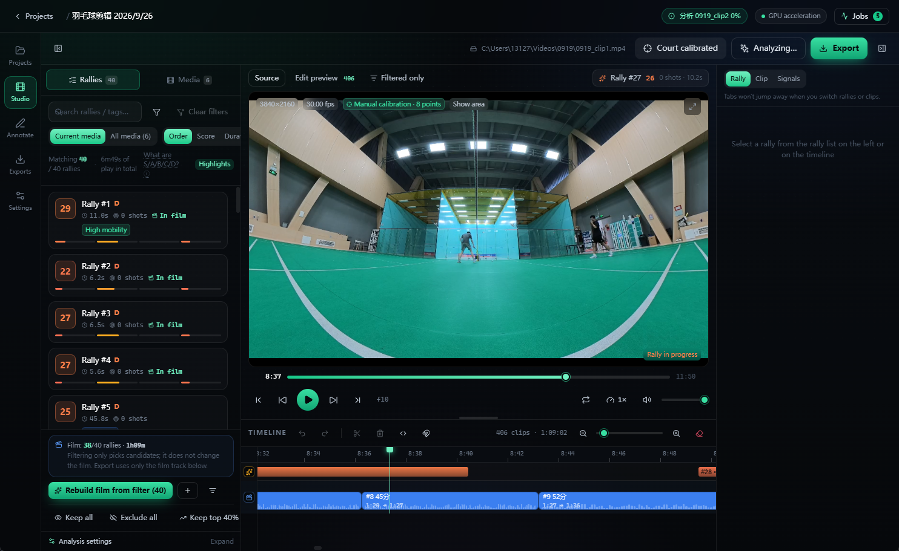

# Badminton Studio

An AI-powered automatic editor for badminton videos on Windows. Import a recording from the court and it
**automatically drops the dead time** (fetching shuttles, walking around, towel breaks), cuts out each rally
separately, **scores** every rally, supports **filtering by score**, and renders a final cut from the rallies
you selected.

The UI is a local web app (dark glassmorphism with animations). All AI runs on your own machine; videos are
never uploaded.



---

## Table of contents

- [What it solves](#what-it-solves)
- [Quick start](#quick-start)
- [UI tour](#ui-tour)
- [How the AI analysis works](#how-the-ai-analysis-works)
- [Rally scoring](#rally-scoring)
- [Annotation and annotation-driven tuning](#annotation-and-annotation-driven-tuning)
- [Scene presets](#scene-presets)
- [Editing and exporting](#editing-and-exporting)
- [Command-line tools](#command-line-tools)
- [Project layout](#project-layout)
- [FAQ](#faq)
- [Measured performance](#measured-performance)
- [Supported camera setups](#supported-camera-setups)
- [Tests](#tests)
- [Known limitations](#known-limitations)
- [License](#license)

---

## What it solves

A two-hour session may only contain twenty minutes of actual rallies, and picking them out by hand is
extremely time-consuming. This app automates it:

| Need | Implementation |
| --- | --- |
| Remove dead time automatically | Multimodal activity detection (player movement + frame motion + hit sounds + shuttle trajectory) |
| Keep only real rallies | Every rally is located beat-by-beat as "serve → receive → …" |
| Cut each rally separately | Rally list + one-click timeline generation, one clip per rally |
| Score by quality | Six dimensions — length / intensity / technique / excitement / highlight / picture quality — plus a total |
| Filter high-scoring clips | Score range, duration, shot count, tags, star rating; multi-criteria filter + "keep top N%" |
| Media management | Multi-select bulk remove (removes from the project only, never touches the files on disk) |
| Everyday editing | Multi-track timeline: drag, trim, split, speed change, snapping, undo/redo |
| Reuse tuning for the same scene | Save "segmentation params + court calibration + preview frame" as a scene preset, then pick one by its screenshot |
| Publish the result | Landscape / portrait / square presets; portrait auto-follows the players; NVENC hardware encoding |

---

## Download & install (portable, Windows)

The fastest way to run the app is the prebuilt portable package from
[GitHub Releases](https://github.com/balabooooo/BadmintonStudio/releases). No Python, Node.js or
CUDA setup is required.

1. Download `BadmintonStudio-<version>-win64.zip` from the latest release.
2. Extract the archive to any folder (e.g. `D:\BadmintonStudio`).
3. Double-click **`BadmintonStudio.exe`**.

The package bundles a CPU-only PyTorch build so it runs on any Windows 10/11 machine; analysis
therefore runs on the CPU. For GPU-accelerated analysis and NVENC export, install from source instead
(see [Quick start](#quick-start)). The YOLO weights and ffmpeg are already included in the package, so
the first analysis works offline.

Runtime state (projects, caches, exports, logs) is written to `%LOCALAPPDATA%\BadmintonStudio`.

> The portable build is produced with `pwsh -File packaging\build_release.ps1` (PyInstaller, one-folder).

---

## Quick start

### Requirements

- Windows 10 / 11
- Python 3.11+ (this project is verified on 3.14)
- Node.js 18+ (only needed to build the frontend)
- Optional: an NVIDIA GPU (NVENC makes export 5–10× faster; analysis can also use CUDA)
- FFmpeg: **no manual install required** — `imageio-ffmpeg` ships a static build. You can also point
  `BMS_FFMPEG` at your own `ffmpeg.exe`.

### Install

```powershell
cd D:\Projects\BadmintonStudio

# 1) Create the virtual environment (--system-site-packages reuses an existing torch install)
python -m venv --system-site-packages .venv

# 2) Install backend dependencies
.\.venv\Scripts\python.exe -m pip install -r requirements.txt

# 3) Build the frontend (once; rebuild after changing frontend code)
cd frontend
npm install
npm run build
cd ..
```

> If `torch` is not installed on the machine, install a CUDA build following the instructions at
> [pytorch.org](https://pytorch.org) first, otherwise player detection falls back to CPU and is much slower.

### Model weights

Model weights are **not committed to the repository** (they are large binaries). They are obtained
automatically or with a small script:

- **YOLO player/pose weights** (`yolo11n.pt`, `yolo11n-pose.pt`): detected in this order — explicit path →
  `models/` → project root → otherwise `ultralytics` downloads them into `models/` on first use. To keep a
  machine offline, place the two `.pt` files in `models/` yourself (they are ~5.6 MB and ~6.2 MB).
- **faster-whisper speech model** (optional, for voice-command scoring): pre-fetch it with:

  ```powershell
  .\.venv\Scripts\python.exe scripts\fetch_speech_model.py            # medium (default)
  .\.venv\Scripts\python.exe scripts\fetch_speech_model.py --size small
  ```

  It downloads `Systran/faster-whisper-<size>` into `models/faster-whisper-<size>/` (medium is ~1.5 GB).
  If you skip this step, faster-whisper downloads the model from HuggingFace on first use. The analysis
  finds a local model automatically, or you can point `BMS_SPEECH_MODEL` at a directory / size / repo id.

`models/*.pt`, `models/*.onnx` and `models/faster-whisper-*` are git-ignored.

### Run

Double-click **`start.cmd`**. It will:

1. start the local service in a background thread (picking a free port automatically);
2. open a native window with pywebview (or fall back to the system browser if pywebview is missing).

You can also start it manually:

```powershell
$env:PYTHONPATH="D:\Projects\BadmintonStudio\backend"
.\.venv\Scripts\python.exe -m uvicorn bms.main:app --host 127.0.0.1 --port 8000
# then open http://127.0.0.1:8000
```

For a native desktop window:

```powershell
.\.venv\Scripts\python.exe -m pip install pywebview
.\.venv\Scripts\python.exe desktop\app.py
```

### Development mode (frontend/backend hot reload)

```powershell
pwsh -File scripts\dev.ps1
# frontend http://127.0.0.1:5273  backend http://127.0.0.1:8000
```

---

## UI tour

```
┌─────────────────────────────────────────────────────────────────────┐
│ Title bar: GPU status · job queue · project name                    │
├──────┬──────────────────────────────────────────┬───────────────────┤
│ Nav  │  Action bar: AI analysis / export         │                   │
│ 库   ├──────────────────────────────────────────┤    Inspector      │
│ 台   │            Preview player                 │   · rally scores  │
│ 出   │  source / cut preview · frame step ·      │   · per-shot      │
│ 置   │  speed · rally loop                       │     timeline      │
│ 注   ├──────────────────────────────────────────┤   · clip range    │
│      │  Timeline: source rally band + video      │   · AI signals    │
│      │  track + playhead                         │                   │
├──────┴──────────────────────────────────────────┴───────────────────┤
│ Left: rally list (score filter / sort / bulk) or media list          │
└─────────────────────────────────────────────────────────────────────┘
```

The navigation rail has five pages: **Library**, **Studio**, **Annotate**, **Exports**, **Settings**.

### Keyboard shortcuts

| Key | Action |
| --- | --- |
| `Space` | Play / pause |
| `←` / `→` | Step back / forward one frame (hold `Shift` for 5 seconds) |
| `Home` | Jump to the beginning |
| `S` | Split the selected clip at the playhead |
| `Delete` | Delete the selected clip |
| `Ctrl+Z` / `Ctrl+Y` | Undo / redo |
| `Ctrl+wheel` | Zoom the timeline |
| Double-click a rally band | Add that rally to the timeline |
| Right-click a clip | Split / slow down / speed up / delete |

Shortcuts only apply on the Studio page, so they never silently edit the timeline while you are annotating.

---

## How the AI analysis works

The pipeline lives in `backend/bms/analysis/`. Four complementary signals run independently; if one is
missing it is down-weighted rather than failing the whole run.

### 1. Audio hit detection (`audio_hits.py`)

A badminton rally is essentially "a string of racket impacts". A racket touch shows up as a very short
(< 15 ms) broadband transient in the mid/high band (about 2–8 kHz), detected with **high-band spectral flux +
adaptive threshold + peak picking**:

- STFT, then positive spectral flux in the 1800–7800 Hz band
- Weighted by **spectral flatness** — an impact is a noise-like transient, while music/speech is narrowband and gets suppressed
- Threshold = long-window median + k × MAD, robust and adaptive
- Low-band energy (80–900 Hz) is used to penalize ambient noise, footsteps and shouting
- Peaks are then aligned sub-frame to the rising edge of the raw envelope for accuracy

**Reliability gating**: a multi-court venue plus camera AGC makes "hit sounds" appear uniformly across the
whole timeline, which carries no rally information. The module computes:

- Coverage (fraction of 2-second bins containing a hit) — real matches are usually 0.25–0.55; > 0.86 is treated as noise
- Average touch rate — the realistic ceiling is about 2.5 hits/s; > 3.2 is treated as noise
- Burstiness (fraction of adjacent gaps < 0.35 s) — high in real rallies

The product is `audio_reliability`, multiplied directly into the audio fusion weight. On the noisy venue
footage tested, this coefficient pushed the weight from 0.95 down to 0.03, preventing the whole clip from
being glued into a single rally.

### 2. Visual motion analysis (`motion.py`)

Runs on low-resolution grayscale frames and is very fast (about 10 s for 5 minutes of footage):

- Frame-to-frame absolute difference → motion energy
- Time-accumulated **activity heatmap** → rough automatic court estimate
- `phaseCorrelate` for global displacement → handheld shake / panning
- Laplacian variance → sharpness (used for the picture-quality score)
- Histogram difference → scene-cut detection

### 3. Player detection and tracking (`players.py`)

Uses **YOLO** to detect people on sampled frames in batches, then **ByteTrack** (the implementation built
into `ultralytics`) to join them into tracks:

- A Kalman motion model predicts track positions; `lap` solves the association
- **Two-stage high/low-score association**: when occluded, low-score boxes reconnect the track, reducing
  one player being split into two tracks
- An adapter drives the tracker frame-by-frame over sampled frames while keeping the original batched GPU
  inference (not per-frame `model.track()`)

It then selects the **actual match players** by "large box + fast movement + present for a long time"
(spectators and people on adjacent courts have small boxes and barely move, so they are excluded).

The output is per-frame "number of active players on court", "average speed" and "maximum speed" — the most
reliable rally signal.

### 4. Shuttle tracking (`shuttle.py`) — off by default, enable on demand

Because the camera is static, **temporal median background modeling** is safe:

- `|frame − median of K frames before/after|` gives the foreground; use `W = min(R,G,B)` (whiteness) instead
  of grayscale, which has a much better signal-to-noise ratio for a white dot on a green court
- Area + morphology + **the surrounding ring must be green court**. This court prior must be applied
  *around* the candidate, not to the candidate itself — the shuttle is white, so requiring "itself is
  greenish" would rule out the real target
- Speed gating (the shuttle is the fastest object on court)
- Frame-to-frame association into trajectories, then **parabolic fitting** to reject random noise; the fitted
  **acceleration must not be below a gravity floor** — a shuttle is necessarily "bent" by gravity, while a
  walking person only produces constant-velocity straight lines

**Why it is off by default**: cost grows with "frames × pixels × time window", so a 30-minute 4K clip takes
hours. When enabled you can set a **time budget** to cap the total cost; if it covers less than 60% of the
timeline the signal is ignored (analyzing only part of the clip would skew the fusion weights).

Measured note: on a 960×540 proxy the shuttle is only 2–5 pixels and is not separable in brightness from
distant white shoes, so at the default sensitivity it honestly returns "0 trajectories" instead of noise.
This signal needs higher-resolution footage to be worthwhile (8–20 px, where whiteness separates again).

### 5. Fusion and segmentation (`rally.py` + `rally_vision.py`)

1. Each signal is first **quantile-robust normalized** (5%–95%) so units cannot dominate each other
2. **Adaptive weights** are computed from bimodality and audio reliability
3. Weighted sum + smoothing → a per-frame activity curve
4. **Segmentation**: prefer cutting at "quiet segments" of player motion (next section); when no player
   signal exists, fall back to valleys of the activity curve or the older hysteresis state machine
5. **Boundary anchoring**: pin boundaries with the hit sequence (next section) — split intervals at large
   gaps in the hit sequence, then anchor the end to "last hit + dead-ball tail"
6. `thin_shots` applies **physical plausibility filtering**: the same side cannot hit twice less than 0.3 s
   apart, so it greedily thins by strength and removes "4 shots per second" noise strings
7. `attribute_sides` assigns serves/receives to specific players: **the larger box is nearer the camera**,
   giving near/far; then see who is moving at the serve moment — the one who just swung is the server. When
   the two depths are close it conservatively stays `unknown`

### Why rally endpoints are "anchored to the last hit"

The physical end of a point is **the shuttle landing**. The most reliable observable substitute is the
**last hit**: after a shot the shuttle still flies for 0.4–1.2 s before landing, so

```
end   = last hit + hit_tail_seconds   (default 0.9 s)
start = first hit − pre_roll          (default 1.2 s, serve preparation)
```

The old code in `refine_with_hits` wrote `iv.end = max(iv.end, last + tail)` — **the end could only be
pushed later, never pulled back**. So no matter how long the interval produced by segmentation was (one
measured "rally" was 69.35 s / 72 shots, actually containing two or three rallies), the hit information
could not trim the segment after the shuttle landed. That is the direct cause of "a rally contains a long
stretch after the shuttle lands".

By the same logic, **"the next rally bleeding into this one" cannot be detected from whether the players
stopped**: players keep moving while fetching shuttles and walking back to serve, so activity never
collapses. But **whether the shuttle is being hit** is a direct observation: within a rally, hit spacing is
determined by shuttle flight time (measured p80 = 1.19 s, p99 = 3.25 s), while between two rallies there is
shuttle fetching / changing serve and **nobody hits anything** typically for ≥ 4 s. So `split_by_hit_gaps`
splits intervals at large gaps in the hit sequence with two guardrails (at least 2 hits on each side, each
side substantial enough to be a rally), separating "a few missed hits" from "genuinely two rallies".

### Pose assist: deciding whether each hit sound is ours (`analysis/pose.py`)

The "anchor to the last hit" scheme has one premise: **the hit sequence belongs to our match**. In a
multi-court venue this does not hold — hits from adjacent courts fill the sequence, so it neither cuts where
it should nor detects that "nobody is playing after the last hit". The tested footage had
`audio_reliability = 0.04`, pushing the audio weight to 0.023 — effectively unusable.

Pose solves exactly this. It is not "a more accurate detector" but evidence of **attribution**:

* Our players only swing when they actually hit; a hit sound from an adjacent court has **no corresponding
  motion** in our frame. For the first time, "is this hit ours?" has a direct observation instead of a guess
  from audio statistics.
* One swing can only explain one hit — this one-to-one constraint is the main reason the gating works.
  Taking only "maximum wrist speed within a window" has no discrimination (measured evidence median 0.72,
  i.e. no filtering at all), because in a rally there is a hit every 1–1.5 s and a ±0.35 s window already
  covers half a shot interval. After **finding swing peaks first and then matching peaks to hits
  one-to-one**, the evidence median dropped to 0.00 and the retention ratio landed at 40%–45%, matching the
  intuition that "our match is roughly half of all hit sounds".

Two engineering choices:

* **No re-detection and no re-tracking** — reuse `PlayerSignal.frame_boxes`. This halves the compute and,
  more importantly, avoids the hardest-to-debug class of bug: two tracking results disagreeing.
* **Crop and upscale the player box to 192×192 before the pose model**. In the tested footage players are
  only ~100 px tall, and full-frame keypoints drift (wrists and elbows are lost first); after cropping and
  upscaling the keypoints are stable, and people on adjacent courts are kept out of the crop. The window is
  shifted **upward with margin**, otherwise the wrist leaves the box on overhead shots.

Measured cost: pose runs only on the 2–4 match players per frame, 5.6 s for 90 s of footage on a 3080,
**about 1.9 minutes for 30 minutes of footage** (~+35% analysis time). Results are cached by "video + player
box fingerprint", so re-tuning segmentation parameters does not re-run it.

**It always degrades rather than becoming a new source of error**: pose coverage below 35%, or a post-gating
retention ratio outside [12%, 97%] (meaning the threshold did nothing, or rejected most hits), or no GPU, or
missing weights — any of these passes all hits through unchanged, identical to turning the switch off. The
"AI analysis" dialog has a **Pose assist (hit attribution)** switch to disable it entirely.

### Cross-court suppression is instant (`resegment` re-gates)

The gate used to be a one-shot decision buried in the full analysis: `hits` was overwritten in place and only
the post-gate sequence was persisted, so changing the threshold — or even forcing the gate when its safety
guard skipped it — required re-running the whole AI pipeline.

Now the **pre-gate candidates** (`hit_times_raw`) and the **full-rate pose swing curve** (`pose_swing_full`)
are persisted alongside the gated result. `pipeline.regate_hits(sig, params)` always starts from the raw
candidates, so

* the rally panel's **Cross-court suppression** slider re-runs the gate in milliseconds through
  `resegment` (no player / motion / audio re-run), and repeated resegments are idempotent (never
  double-filtered);
* `pose_gate_force` overrides the retention-ratio safety band when the user explicitly wants to filter anyway;
* the **Annotate** page's optimizer can search the gate threshold as a separate stage, scored by **hit-level
  precision / recall** when hits are labeled "ours / neighbor", instead of only by rally IoU.

Projects analyzed before this change have neither field; the **Rebuild hits** action re-runs only the cached
audio detection (cheap STFT) and recovers the pose signal from `data/cache/pose/*.npz` when possible, so the
slider becomes usable without a full re-analysis. The calibration can be saved into a **scene preset**
(which now also carries the gate parameters and a small `fit` record) and reused across projects.

### Why the old rally boundaries were wrong, and what changed

The old segmentation was built entirely on **full-frame fused activity**. That approach fails on real
footage, and it fails for a fundamental reason:

1. **Full-frame motion carries no rally information.** Spectators walking, adjacent-court play and lighting
   changes keep full-frame motion energy high at **all** times. The activity curve therefore never collapses
   between rallies, and the hysteresis state machine never decides "this segment ended". On 30 minutes of
   measured footage it produced only 8 intervals, one 236 s and one 138 s long.
2. **1.2 s of smoothing erases the pauses.** There are only a few seconds of silence between rallies; after
   a 1.2 s moving average and adding persistent background motion, the valleys disappear.
3. **So "segmentation" became "even splitting".** Overlong intervals fell into `_split_by_valley`, which
   cuts at the lowest internal point even when the interval is only slightly longer than the target. The
   result was 32 rallies averaging 20.1 s (median 19.8 s), with many segments **butting end-to-end** (one
   `end` exactly equal to the next `start`). This cannot happen in a real match: after a point there is
   always a pause to fetch the shuttle / change serve, so **there is always a gap** between rallies.
4. **The player signal was empty outside the middle.** In long videos, players change id whenever they are
   occluded or leave the frame (285 tracks in a 30-minute clip), while "select match players" ranked **the
   top 4 tracks by whole-clip statistics** — so all 4 could fall in the middle of the video. `frame_boxes`
   was empty elsewhere and `player_motion` was a constant 0 (measured: the first 372 s were all 0). The
   "player-motion segmentation" path was dead, with coverage of only 0.48.

The current approach (`analysis/rally_vision.py` + `analysis/rally.py`): **find pauses with player motion,
then pin the boundaries with the hit sequence.**

A rally means "serve → rally → dead ball → fetch/prepare → next serve". Players are the only reliable
observation spanning the whole process: during a rally both match players move fast continuously, and after
the dead ball they stop — **this pause necessarily appears between rallies**, and people on adjacent courts
do not create it.

- Compute "how much each player moved this frame" from the detection boxes (`box_motion`, **per player,
  then take the most active one**, so background movement does not pollute the signal).
- On a local time scale, run a **minimum + prominence** analysis to split the curve into alternating
  "active / quiet" segments. The prominence threshold is defined as a ratio of `(p95 − p20)`, so quiet and
  noisy venues share one parameter set without hand tuning.
- **Define boundaries with quiet segments**: start = the first clear movement after a pause ends; end = the
  last clear movement before the next pause. The resulting interval is exactly "the time the shuttle was in
  play", without fetching-shuttle walking.
- "Select match players" becomes **per time window** (`_select_active_players_windowed`): each window ranks
  only the tracks overlapping it, then the per-window results are unioned. Reassigning a player a new id in
  one stretch no longer removes the signal there.
- Then the **hit sequence** does the final correction: split at large gaps and anchor the end to the last
  hit (previous section).
- When the shuttle signal is available, one more check: if almost no shuttle is seen in the core interval,
  it was actually fetching/changing ends.

**Adaptive degradation**: when player detection fails (players too small, non-match footage) it falls back
to activity-valley segmentation (`segment_activity`) — which also only accepts sufficiently prominent
valleys and never splits mechanically; only if both fail does it fall back to the old hysteresis state
machine, matching the old behavior exactly. Under "AI analysis → Camera & court → Segmentation basis" you can
pin one method or choose "compare and pick the best". **Boundary anchoring runs on every path** (including
fast resegmentation) because it is pure logic and does not need to re-run AI.

"Compare and pick the best" (`auto`) works **per time window** (`_merge_by_availability`), trusting one side
per window: windows with valid player detection follow player segmentation; invalid windows use activity.
There is one easy-to-miswrite and hard-to-notice case — **player detection valid but player segmentation
yields no candidate**:

* If the players **did not move**, it is a genuine pause (shuttle fetching / changing serve between two
  rallies) and must stay empty. The old code fell back to the activity candidate here, filling the pause and
  immediately gluing back together the rallies player segmentation had just separated (measured: the longest
  rally gained 6 extra seconds).
* If the players **are moving**, it is a miss by player segmentation (it has thresholds on movement duty
  cycle / core segment length, and mixed segments are easily dropped entirely), and activity must catch it,
  otherwise the whole rally disappears (measured: recall dropped 6 percentage points).

The decision uses the player-motion curve itself, with thresholds identical to
`segment_by_player_motion` (resting floor + 25% dynamic range).

### Adapting to different footage

Recording conditions vary a lot, so every signal computes its own reliability and the weights are dynamic:

- **Quiet venue + clear hit sounds** → high audio weight, very accurate segmentation
- **Noisy multi-court venue + camera AGC** (such as the GoPro footage tested) → audio weight pushed near 0,
  player motion takes over
- **Players too small / not detected** → falls back to motion + audio

### When rallies are not cut cleanly: instant resegmentation

In continuous-training or multi-shuttle practice footage, players only pause for a few seconds between
rallies and the activity curve **does not collapse**. The analysis also stores the **full-frame-rate fused
activity curve**, the **full-frame-rate player-motion curve** and the **per-frame player detection
coverage**, so tuning "padding / shortest rally / longest rally / segmentation basis / dead-ball tail" only
re-runs "segmentation + features + scoring" — milliseconds, without waiting minutes for player detection,
pose and motion analysis.

**Resegmentation uses exactly the same segmentation logic as a full analysis** (`_segment_rallies`),
rather than degrading to "activity only": the player-motion curve and coverage are stored, so player
segmentation, per-window best-of, hit-gap splitting and endpoint anchoring all still apply. This matters
because resegmentation is precisely the most common operation when tuning segmentation parameters — if it
produced a different rally count than a full re-run, the user could never tell what a parameter change did.

Under "Rallies → Rally segmentation tuning" on the left you can adjust in real time:

| Parameter | Effect |
| --- | --- |
| Segmentation granularity | Higher prefers cutting at activity valleys (only for activity-based segmentation) |
| Gap threshold | Two candidates closer than this are merged |
| Shortest rally | Segments shorter than this are dropped |

Segmentation also does two finishing passes:

- **Overlong segments are cut at the deepest internal pause**, not split mechanically
- **Adjacent overlaps are removed**: when boundaries snap back, each rally keeps padding on both sides, so
  close rallies cover each other by a few seconds and would show the same footage twice in the timeline.
  `dedupe_overlaps` cuts the overlap between two hits

If the automatic result is not good, every key parameter can be tuned live in the UI, and you can manually
keep / exclude / star rallies in the list; changes reflect directly on the timeline. A "minimum confidence"
filter additionally drops clips where "the AI is not sure".

---

## Rally scoring

Scoring is a **explainable formula**, not a black box (`analysis/scoring.py`).

| Component | Basis |
| --- | --- |
| **Length** | Shot count and duration, with a saturation curve (so an overlong rally does not dominate) |
| **Intensity** | Player speed, peak frame motion, overall tempo, **late-rally tempo** (a late acceleration adds points) |
| **Technique** | Shuttle speed, hit power, shuttle persistence in frame |
| **Excitement** | Length + intensity + late-rally surge + long-rally weighting |
| **Highlight** | Smash count, fast-exchange streak, tempo variance (only the Pro Highlights preset gives it weight) |
| **Picture** | Sharpness, shake, subject large enough (only clear enough to be worth using) |

Total = weighted sum × analysis-confidence discount (+ optional voice-command bonus).

### Scoring profile presets

| Preset | Emphasis | Use |
| --- | --- | --- |
| Balanced | All dimensions | Default |
| Highlights | Intensity + technique | Short, fierce highlight edits |
| Pro Highlights | Smash + fast-exchange streak + tempo variance | Professional highlight reels |
| Long rallies | Shot count + duration | Finding grind-it-out points |
| Technique | Shuttle speed + power | Reviewing technique |
| Training review | Picture completeness | Teaching material |

Switching a preset **only re-scores, it never re-runs the AI analysis**, so it is instant.

### Automatic tags

After analysis, canonical tags such as `ultra_long_rally / many_shots / fast_tempo / late_acceleration /
high_mobility / fast_shuttle / long_rally / short_rally / high_score / low_confidence / smash /
confrontation / highlight` are applied and can be used directly as filter criteria.

---

## Annotation and annotation-driven tuning

The **Annotate** page lets you mark rallies by hand and then use those marks to **automatically tune the
segmentation parameters**. This closes the loop that previously had no ground truth: before this, the
quiet-segment scales and minimum rally length could only be tuned by eye.

Workflow:

1. **Draft from the current analysis.** One click turns the AI's rallies into a draft annotation (semi-
   automatic), so you mostly adjust rather than start from scratch.
2. **Mark rallies.** Play the proxy, mark the start/end of each real rally, add notes. Annotations are saved
   per media clip as `data/annotations/<proxy-name>.anno.json` and exported to CSV on demand.
3. **Evaluate.** The current parameters are scored against your annotation with IoU-based matching,
   producing Precision / Recall / F1 (`analysis/annotation.py`). Scoring runs inside an evaluation
   window (the saved focus ∩ your annotation's bounding box): regions you did not annotate are
   neither positive nor negative evidence, so annotating only part of the video is safe.
4. **Optimize.** A grid search over the segmentation parameters (four quiet-segment scales + minimum rally
   length) re-runs only "segmentation + finishing" on the stored signals — no AI is re-run — and returns the
   best-F1 combination plus the top results. When F1 ties, recall and precision break the tie, so it does not
   simply pick "the parameters that cut less".
5. **Apply.** Write the chosen parameters back to the project and resegment (a single fast pass).

The page also shows objective suggestions computed straight from the annotation (rally count, min / median /
max duration, median / min gap) to explain why a parameter set fits better. This is the same machinery as
`scripts/eval_segmentation.py`, but inside the app.

## Scene presets

A **scene preset** packages "segmentation params + court calibration + a preview frame" so it can be reused
across projects (`core/presets.py`, `api/presets.py`). It is saved from the Annotate page and applied from
the "Scene presets" strip in the AI analysis dialog.

Design choices:

- **Manual selection, not automatic matching.** There is no reliable measure of scene similarity, and a
  forced match silently applies unsuitable parameters to new footage. The preset is shown together with the
  frame captured at save time, and you judge from the screenshot whether it looks similar.
- **Storage is project-independent**: `data/presets/<id>.json` + `<id>.jpg`, visible to every project.
- Applying a preset **writes the segmentation parameters and court polygon into the current media only**; it
  does not automatically re-run anything. You can then start an analysis or resegment from the Annotate page.

The parameter whitelist covers only quantities that actually affect segmentation/boundaries
(`seg_prominence`, `seg_min_core`, `seg_min_rest`, `seg_min_quiet`, `min_rally_seconds`, `max_rally_seconds`,
`pre_roll`, `post_roll`, `hit_tail_seconds`), not the whole `AnalysisParams` — `use_*` switches describe "how
to run this time", not "what this scene should use".

---

## Editing and exporting

### Timeline

- The top strip is the **source rally band**: every detected rally colored by score, so you can see at a
  glance which parts are worth keeping
- Single click to seek, double click to add to the timeline, right click for bulk actions
- Clips on the video track support drag to move, drag ends to trim, split, speed change and volume
- Snapping points include the playhead, adjacent clip boundaries and rally start/end
- Full undo / redo

### Export

| Preset | Spec |
| --- | --- |
| Landscape 1080p / 4K / 720p | H.264 |
| Portrait 1080×1920 | TikTok / Xiaohongshu, **auto-follow court cropping** |
| Square 1080×1080 | Moments/feed |
| 4K HEVC | Space saving |

The encoder is chosen automatically: `h264_nvenc`/`hevc_nvenc` when NVENC is available, otherwise `libx264`.

The export implementation has two paths (`render/exporter.py`):

- **Single-pass filter graph**: for the same media and ≤ 80 clips, one `trim` + `concat` `filter_complex`
  encodes in a single pass — fastest and best quality
- **Segmented fallback**: across media or with many clips, render uniform intermediate segments first and
  concat them

Portrait cropping reads the **per-frame subject horizontal center** from the analysis phase, so the camera
follows the players instead of a rigid center crop.

Finished files can be written to **any directory** (no longer fixed to `data/exports`). A registry
(`core/exports.py`, `data/exports/index.json`) tracks each output so the Exports page can list, replay and
download them by id. Re-exporting to the same path overwrites the old entry; missing files disappear from
the list.

---

## Command-line tools

The whole pipeline runs without the UI, which is convenient for tuning and batch work:

```powershell
$py = ".\.venv\Scripts\python.exe"

# Probe a video (sample frames, inspect camera angle, get duration/resolution)
& $py scripts\probe_video.py "D:\Videos\match.mp4" --from 0 --span 120 --n 8

# Audio hit-detection diagnostics (print detected hits + save signals)
& $py scripts\test_audio.py "D:\Videos\match.mp4" --from 0 --to 300

# Plot audio diagnostics (waveform / spectral flux / threshold / detections / spectrogram)
& $py scripts\plot_audio.py data\cache\audio\xxx.wav --from 0 --to 40

# Motion signal only
& $py scripts\test_motion.py data\cache\proxies\xxx.mp4

# Run the full analysis pipeline and print the rally table
& $py scripts\run_analysis.py "D:\Videos\match.mp4" --weights highlight

# Turn the analysis result into diagnostic plots
& $py scripts\plot_analysis.py

# Start the service and run an end-to-end smoke test (create project → import → analyze → auto-cut → export)
& $py scripts\e2e_test.py "D:\Videos\match.mp4"

# Warm up a long video: only generate proxy/audio/cover so later analyses reuse the cache
& $py scripts\warmup.py "D:\Videos\match.mp4"

# Offline evaluation of segmentation against a manual annotation (no AI re-run)
& $py scripts\eval_segmentation.py

# Pre-fetch the faster-whisper model used by voice-command scoring (optional; auto-downloads otherwise)
& $py scripts\fetch_speech_model.py

# Offline segmentation tuning / grid search against manual annotations (clip2 / clip5)
& $py scripts\tune_clip25.py

# Offline A/B scoring evaluation (balanced vs highlight_pro) on annotated rallies
& $py scripts\eval_scoring_ab.py

# Transcribe a clip's audio with faster-whisper to tune voice-command detection
& $py scripts\transcribe_speech.py "D:\Videos\match.mp4" --around 638 --phrases 好球 漂亮
```

The backend also ships OpenAPI docs: once the service is running, visit
<http://127.0.0.1:8000/api/docs>.

---

## Project layout

```
BadmintonStudio/
├─ backend/bms/
│  ├─ config.py            Paths and global config (overridable via BMS_* env vars)
│  ├─ main.py              FastAPI: projects/media/analysis/rallies/timeline/export/jobs + WebSocket
│  ├─ core/
│  │  ├─ ffmpeg.py         ffmpeg/ffprobe discovery, capability probing, progress-aware command execution
│  │  ├─ media.py          Probe, proxy video, audio track, poster, sprite sheet, frame extraction
│  │  ├─ models.py         Pydantic domain models
│  │  ├─ jobs.py           Background jobs (progress / cancel / broadcast)
│  │  ├─ store.py          Project JSON persistence
│  │  ├─ streaming.py      HTTP Range video streaming (browser seek bar)
│  │  ├─ presets.py        Scene presets (params + court calibration + preview frame)
│  │  └─ exports.py        Export registry (data/exports/index.json)
│  ├─ api/
│  │  ├─ annotations.py    Rally annotation + annotation-driven tuning routes
│  │  └─ presets.py        Scene preset routes
│  ├─ analysis/
│  │  ├─ audio_hits.py     Hit-sound detection + reliability estimation
│  │  ├─ motion.py         Motion energy / shake / sharpness / activity heatmap
│  │  ├─ court_calib.py    Court calibration (floor color → polygon → homography) + camera-angle detection
│  │  ├─ players.py        YOLO detection + ByteTrack tracking + match-player selection (camera-adaptive + box size filtering)
│  │  ├─ shuttle.py        Shuttle candidate detection + parabolic trajectory association
│  │  ├─ rally.py          Multimodal fusion + hysteresis state machine + boundary snapping
│  │  ├─ rally_vision.py   Player-motion quiet-segment segmentation (primary) + activity-valley segmentation (fallback)
│  │  ├─ pose.py           Pose-assist hit attribution + composite gate (local strength + pose evidence)
│  │  ├─ scoring.py        Six-dimension scoring (incl. highlight) + tags + statistics
│  │  ├─ speech.py         Optional voice-command scoring (faster-whisper + near-homophone match)
│  │  ├─ annotation.py     Manual annotation I/O + annotation-driven parameter search
│  │  └─ pipeline.py       Orchestrates the whole flow, produces AnalysisResult
│  └─ render/exporter.py   Timeline export (single-pass filter graph / segmented fallback / portrait follow)
├─ frontend/               React 19 + TS + Vite + Tailwind v4 + Motion
│  └─ src/
│     ├─ components/       Shell, library, player, timeline, rally panel, inspector, dialogs, annotate page
│     ├─ store/useStore.ts Global state (undo/redo, playback, filtering, presets)
│     └─ lib/              API client, WebSocket, types, formatting
├─ desktop/app.py          pywebview desktop shell
├─ scripts/                Command-line tools and diagnostics
├─ docs/                   Technical reports (segmentation/scoring optimization, UI redesign)
├─ data/                   Runtime data (projects, cache, exports, annotations, presets)
└─ models/                 Model weights (not committed)
```

Data directory:

```
data/
├─ projects/*.json         Project files (human-readable, editable, backup-able)
├─ cache/proxies/          Low-resolution proxy videos for analysis
├─ cache/audio/            Extracted 16 kHz mono audio tracks
├─ cache/thumbs/           Posters and timeline sprite sheets
├─ cache/frames/           Diagnostic frames + size-filter probe frames (probe/)
├─ annotations/            Manual rally annotations (<proxy-name>.anno.json)
├─ presets/                Scene presets (<id>.json + <id>.jpg)
├─ exports/                Exported videos + index.json registry
├─ logs/                   Runtime logs
└─ uploads/                Files copied in by browser drag-and-drop (the native window references by path)
```

---

## FAQ

**Q: Analysis is slow. What can I do?**

The first analysis of a long 4K clip generates a low-resolution proxy. This uses the **CUDA decode →
`scale_cuda` → NVENC** GPU chain and measured **177 s** for 30 minutes of 4K (about 10× real time); if the
GPU does not support the chain it falls back to CPU software encoding, about an order of magnitude slower
but still usable.

Repeated parameter-tuning analyses reuse the cache (proxy filenames include a hash of the media id, so it is
idempotent). You can also pre-run it with `scripts/warmup.py`.

The analysis itself runs on the proxy: about 6–10 minutes for 30 minutes of footage, with **player detection
and tracking dominating**.

**Q: Why is "shuttle tracking" off by default?**

Its cost grows with "duration × resolution" and can reach hours for 30 minutes of footage. Rally
segmentation mainly relies on player motion and frame motion, so it works fine without it. Enable it in "AI
analysis" when you need shuttle-speed data, and set a time budget.

**Q: Can I use it without an NVIDIA GPU?**

Yes. It falls back to CPU automatically: player detection is slower, and proxy generation and export use
`libx264`. Functionality is identical.

**Q: Rallies are cut too finely / glued together.**

Go to "AI analysis" and tune three things: "Rally gap threshold" (lower if glued, higher if too fragmented),
"Minimum rally duration", and "Hit detection sensitivity". You can also keep / exclude rallies manually in
the list. If you always use the same camera setup, tune once.

**Q: The audio is mostly courtside noise — will it hurt the result?**

No. The audio path computes its own reliability (coverage / touch rate / burstiness); when noise is high its
weight drops near 0 and player motion plus frame motion take over.

**Q: Which formats are supported?**

Anything FFmpeg can decode: MP4 / MOV / MKV / AVI / MTS, H.264 / H.265 / ProRes, etc.

**Q: Why can't I drag a large file in?**

For security, the browser only gets the dropped file's contents, not its local path, so a drop effectively
copies the whole file; files over 2 GB are skipped automatically — use "Choose video". The **native desktop
window** (with pywebview installed) is the exception: it gets the full path, references the file without
copying, and accepts drops of any size, just like "Choose video".

**Q: Will it use a lot of disk space?**

Proxy videos are about 1/50–1/100 of the source (a 960p proxy of 30 minutes of 4K is about 260 MB). The
Settings page can clear the cache at any time; clearing does not affect the original media, only requiring
regeneration on the next analysis.

**Q: Voice-command scoring — what is it?**

An optional mode that uses a local faster-whisper model to recognize 1–2 short phrases you configure
(for example "好球" / nice shot) and adds bonus points to rallies where they are heard. A near-homophone
pass (via pypinyin) also counts mis-heard variants such as "到球" / "倒球" as "好球". It is off by
default, needs the `faster-whisper` dependency (and downloads a model on first use), and degrades
silently if either is missing. It **does not affect segmentation**, only scoring. See the model section
above for how to pre-fetch the model.

---

## Measured performance (RTX 3080, 30 minutes of 3840×2160 HEVC)

| Stage | Time | Notes |
| --- | --- | --- |
| Proxy generation (960×540 / 30 fps) | **177 s** | Full GPU chain, about 10× real time |
| Audio track extraction | 15 s | |
| Player detection and tracking | ~3.5 min | YOLO11n + custom tracker |
| Frame motion analysis | ~45 s | about 10 s per 5 minutes |
| Fusion + segmentation + scoring | seconds | |
| **Whole analysis pipeline** | **237 s** | 30 minutes → 13 rallies |
| Export 1080p (NVENC, 13 clips / 698 s) | **343 s** | Sparse clips use segmented export to avoid decoding from 0 |
| Export portrait 1080×1920 (auto-follow crop) | 691 s | Portrait crop + per-clip subject positioning |

> The key to export performance: a single-pass `trim`+`concat` filter graph **cannot seek**, so it must
> decode from one input sequentially to the last clip. When "decode span / actual output" exceeds 1.5×, the
> exporter switches to the segmented path (each segment seeks quickly with `-ss`), which measured about
> twice as fast.

---

## Supported camera setups

This is the capability added in the current version. Before this, the whole analysis chain **hard-coded one
setup**: a static ultra-wide camera behind a baseline of a court, with a green floor. These priors were
scattered across judgments like "the players are the two largest boxes", "a larger box is nearer the
camera", and "the bottom edge of a player box lies in the horizontal band 0.40–0.65 of the frame height".
Another angle would not raise an error — it would **silently produce wrong results**.

The analysis now starts with a **court calibration** (`analysis/court_calib.py`, about 1–2 s):

1. **Find the floor color.** Count a hue histogram in the bottom 45% / horizontal middle 60% of each frame
   (where the court must be), then do a small search over hue/saturation/value with the goal "the bottom
   center of the frame is definitely covered, but the covered area is not too large". This search is
   necessary: in the tested footage the mat hue is 82 (teal), while **wall wood paneling and ceiling are
   92–98** — only a dozen bins apart — and at the far end the mat saturation drops from 215 to 81. Any
   hard-coded threshold would either miss half the court or include an entire wall.
2. **Fit the court boundary and compute the homography.** Take the intersection of masks across several
   frames (the real floor is present every frame; players/spectators/adjacent courts only occasionally
   match, so the intersection filters them out), fit a boundary polygon, then pick the **largest inscribed
   quadrilateral** to compute the homography (mapping the frame to a unit square). Coordinates use a **unit
   square** rather than real meters: usually only half the court is visible, and forcing a mapping to
   13.40 m would stretch the longitudinal distances by more than 2×, worse than no calibration.
3. **Determine the camera angle.** Use three frame-orientation-independent quantities: the far/near width
   ratio of the court (perspective), how spread out the players are horizontally/vertically, and the box
   height ratio of two players on screen. Output `rear` (behind baseline) / `side` (side line) /
   `elevated` (high oblique) / `overhead` (top-down) / `unknown`.

### The court boundary is a **polygon**, not just four corners

A panoramic or fisheye lens makes the court boundary **curved** (barrel distortion, worse toward the frame
edges). Calibration used to represent the court as only "four corners", assuming the boundary is straight in
the frame, so:

- framing a curved court with four corners either clips the corners or includes the stands outside the court;
- and "is the player on court" was judged by the **bounding rectangle**, so the curved-edge error at the
  frame corners could balloon to include an entire stand — exactly where background people are densest.

Calibration therefore represents the court as an **N-point polygon (4–24 points)**:

| Use | Representation |
| --- | --- |
| Decide "is the player on court" | **Polygon** (ray casting, boundary expanded 4%, see below) |
| Analysis ROI (coarse range) | Bounding rectangle of the polygon |
| Homography (who is nearer the camera, distance comparison) | **Largest inscribed quadrilateral** of the polygon |
| Camera-angle decision | Homography + player distribution (unchanged) |

- **The point count follows the data**: automatic calibration starts at 4 points and adds more, taking the
  first count that reaches "IoU ≥ 98.5% with the original floor region". A straight boundary stays at 4
  points (ordinary setups behave exactly as before); a curved boundary becomes 8–14 points. The criterion is
  IoU rather than area difference, because area difference cannot detect "the shape is right but shifted".
- **"How much it curved" is written into the result**: `calibration.distortion` is the extra area of the
  polygon over the fitted quadrilateral. Above 6%, `calibration.notes` warns of "a typical sign of
  ultra-wide/fisheye distortion".
- **The polygon is expanded by 4%** (each edge moved outward by 0.04 frame units) before the on-court test.
  The cost of judging the wrong way is asymmetric: keeping one extra person is only noise (size filtering
  and activity scoring follow), while missing a real player breaks the downstream activity curve and crop
  following.

Calibration then **feeds back into the analysis**:

- **The court ROI becomes a hard filter for player detection**: only boxes whose bottom-edge center falls
  inside the court **polygon** are candidates, so "the two largest boxes are the players" is no longer the
  only defense; people on adjacent courts and spectators in the stands are dropped directly. The actual
  range used is visible as `stats.effective_roi` (bounding rectangle) and `stats.effective_poly` (polygon).
- **The camera angle selects the prior parameters.** Under a high/overhead angle everyone is the same size
  in frame, so "large box = near the camera" is simply false: match-player selection switches to
  "motion-dominant, area only a minor adjustment", the "penalty for touching the frame edge" is removed (an
  overhead shot may legitimately sit to one side), and `near` / `far` are **no longer emitted** (previously
  it hard-coded a `near` under these angles, presenting a guess as a measurement; now uncertain means
  `unknown`).
- **Geometric thresholds are relaxed accordingly.** In an overhead view people are "short and wide" with an
  aspect ratio above 1.8, and the old hard crop would discard real players.
- **You can verify it on screen**: a "Court calibration" button appears at the top-left of the preview;
  opening it draws the detected court range and the camera-angle decision over the frame, so you can see at
  a glance which court it is looking at.

Under "AI analysis → Camera & court" you can choose:

| Option | Description |
| --- | --- |
| Auto-detect | Default. Uses the method above; works for most cases |
| Behind baseline / Side line / High oblique / Top-down | Pin the setup when you always use it, skipping the guess (measured metrics are still computed and recorded for verification) |
| Auto-calibrate court | Turn off to fall back to full frame + generic parameters (useful for multi-court venues or unusual mat colors) |
| Segmentation basis | Player motion (recommended) / frame activity / compare and pick the best |

### Auto-calibration inaccurate? Calibrate manually once

Auto-calibration finds the court from "floor color + per-row analysis" and can frame the **near half-court**
accurately on the tested footage, but it drifts in two cases:

- the far end of the court is washed out by ceiling lights and its saturation falls to a third of the near
  end, so it is classified as "wall" and excluded;
- multi-court venues and unusual mat colors (plain gray / wooden floor / strong reflections) break the color
  prior itself.

In these cases continuing to tune the algorithm is inefficient; **drawing it once by hand is easier**. There
are three entry points:

- the **"Calibrate court"** button in the Studio action bar;
- the camera-angle badge at the top-left of the preview (click it to edit);
- the **"Calibrate court manually"** button under "AI analysis → Camera & court".

It opens the current frame (the poster) and you **click around the court boundary**:

| Action | Description |
| --- | --- |
| Drag a vertex | Fine-tune its position |
| "+" on an edge midpoint | **Insert a vertex on that edge** — add points where the boundary curves |
| "Add midpoint to every edge" | Insert one midpoint per edge at once: the easiest one-step fix for curved (fisheye/panoramic) edges |
| Select a vertex → "−" | Delete the vertex (minimum 4 remain) |
| Double-click the frame | Insert a point at the nearest edge midpoint (no need to hit the small "+") |

The point count is 4–24: **4 points is the traditional quadrilateral**, with the first point at the
left-most corner of the side nearer the camera (the first two near, the last two far); order does not matter
because the system sorts them into a ring by their vertical position. Multi-point (6–14) is used to describe
a panoramic/fisheye curved boundary — after clicking a ring of points, `parameters.court_poly` carries all of
them and the UI shows "curved edge about X%".

Initial positions prefer "your last calibration", then "the AI result", and only fall back to a default
trapezoid — so most of the time you only need to nudge one or two points.

Saving writes into the **project file** (stored per media under the key `ui.court_polys`; the old
`court_quads` remains compatible), so it survives reopening the project and applies directly on the next
analysis (corresponding to `params.court_poly`; the old `params.court_quad` is still accepted). The dialog
also offers "Clear" to return to auto-detection.

Calibration only affects "where to look for match players, who is nearer the camera, and which way to crop
for portrait"; it never modifies the original video. "Show range" at the top-left of the preview overlays
the detected court range for verification — it **dims everything outside the court**, so "which area is it
looking at" is obvious at a glance (the most common calibration mistake is including the stands).

### Player box size: two thresholds, the second one is yours

"Large box = near the camera" is not enough as a **bonus** alone: a track that is "small but always moving"
(walking spectators, warming up on an adjacent court) can squeeze into the candidates via its speed score.
So size is a **hard threshold**, and there are two:

1. **Automatic threshold (default)**: after player detection, first estimate "how big a player is in this
   match" — take the 90th percentile of the largest box per frame as the reference scale (match players are
   the largest people in frame, and this points at real players under any camera angle), then exclude tracks
   that are **clearly too small**, with a second size cut afterwards (match players never differ in size by
   more than 2×). If the reference scale is below 6% of the frame height, this step is skipped entirely, to
   avoid filtering everyone out on footage where "nobody is detected". The upper size limit of detection
   boxes is relaxed to 4× the reference scale as well (in close-ups a player occupies a large area; this
   only wants to block "a whole person pressed against the lens").
2. **Manual threshold ("AI analysis → Find who: person-box size")**: the automatic threshold fails on two
   kinds of footage and can only be set by the user:

   - **The stands/spectators are nearer the camera than the players** (side-line setups with stands right
     behind the camera): the reference scale is hijacked by the largest spectator box, and the real players
     become the "too small" batch;
   - **Severe panoramic/fisheye distortion**: the same player's box height can differ by more than 2×
     between the frame center and corners, so "how big counts as a player" is not one number across the
     frame.

   The panel offers two measures:

   | Measure | Criterion | Best for |
   | --- | --- | --- |
   | **Absolute ratio** | box height ÷ frame height | Fixed setup with stable box sizes |
   | **Same-frame relative** | box height ÷ **largest box height in the same frame** | Severe distortion / nearer spectators: renormalized per frame, immune to "different position, different size" |

   You can also clamp **area** (distortion widens boxes rather than heightening them, where area is more
   sensitive).

   Tuning is immediate and **visible**:

   1. **Frame check (manual frame pick)**: drag a slider in "Frame check" (opening the panel defaults to the
      preview playhead) → click "Grab this frame"; the **frame itself** is extracted and every detected box
      is drawn on it: <span>solid green = kept, dashed red = filtered</span>, each box labeled with its
      height (e.g. `#3 12.4% below lower bound`), and hovering shows height/area and the verdict.
      **Dragging the threshold slider recolors the frame instantly** — the decision is made locally without
      re-running detection, so "is what got filtered a spectator in the stands, or a real player?" is
      obvious, which pure numbers (box height 12%) can never show. Grabbed frames line up as a thumbnail
      strip for comparison across moments (side change, timeout, staff walking past). "Evenly probe 10
      frames" samples 10 frames across the whole video, showing the size distribution of all kinds of
      people at once.
   2. **Distribution**: a **box-height histogram** (counting boxes **before** filtering, bars colored by
      keep/drop), recomputing the retention ratio live as the slider moves.
   3. **Measured data**: frame grab and probe do **detection only, no tracking**; the first call is about
      4 s (including loading the model), and later grabs on the same video are **a fraction of a second**
      (model reuse + decoding only that frame). The analysis result carries the same distribution
      (`stats.player_trace.size_filter`, with per-frame reference scale, dropped box count and `sample`),
      so the threshold is tried on **measured data**, not guessed.

   > Grabbed frames land under `data/cache/frames/probe/` (about 30 KB each, overwritten by name) and are
   > cleared together by "Settings → Clear cache".

   > "Keep as-is when everything is filtered" is intentional: better to give the tracker a little noise than
   > to have "no box at all for a whole stretch", which would break the downstream activity curve and crop
   > following.

Other camera-related corrections:

- **Portrait auto-follow now uses a "left-right envelope".** The old implementation took the **mean** of all
  player box centers; under a side-line setup the two players are at opposite ends of the frame and the mean
  lands exactly between them, so the crop aimed at neither. It now sizes the crop to "fit both players from
  their left-most to right-most extent", which also works for doubles.
- **Fixed horizontal stretching that could appear in portrait exports**: the old implementation widened the
  crop beyond the target aspect when "doubles do not fit", then the scaler stretched it directly to 9:16,
  making people look fat. The crop box is now always exactly the target aspect; when the field of view is
  insufficient it **upscales proportionally** instead of changing the shape.
- **Fixed "two different people judged as one" on portrait footage**: the frame aspect ratio used when
  detecting duplicate boxes was hard-coded to 1.78; on 9:16 footage the horizontal distance was magnified
  more than 3×, merging two players standing not far apart.

---

## Tests

```powershell
.\.venv\Scripts\python.exe tests\test_core.py
```

The suite covers the places where **silent failures are most likely**, not algorithm accuracy:

- Every keyword argument the pipeline passes to `analyze_players` / `analyze_shuttle` /
  `_select_active_players` / `probe_boxes` must exist in the signature. Player-module exceptions are
  swallowed by the pipeline's try/except and only written to `player_trace`, so the UI looks like "analysis
  succeeded" while the results are garbage; such interface mismatches must be caught by tests.
- Player box size thresholds: too-small tracks must be excluded and real players selected; **both box
  representations (5-tuples with track ids / 4-tuples from the detection stage) must yield a reference
  scale** — when only 5-tuples are recognized, `ref` is always 0 and the adaptive threshold silently fails,
  which a unit test feeding only 5-tuples would never catch.
- Person-box size filtering: both measures (absolute / same-frame relative) plus area bounds judged
  correctly line by line; an invalid mode degrades to "no filtering"; the histogram must count boxes
  **before** filtering; the probe frame path must be stable and unique, and must **skip black frames
  returned after a seek** (grabbing a black frame for the user is useless).
- Court polygon: ring ordering, largest inscribed quadrilateral fitting, on-court tests (beyond a curved
  edge must be off-court), points on an edge after expansion must be on-court, and degenerate polygons (too
  few points / too small area) must be rejected.
- The auto-calibration point count follows the data: **a curved mask fits more than 4 points, a straight
  mask stays at 4**.
- Manual calibration parsing: wrong point count / pixel coordinates / zero area / empty values must be
  rejected (4–24 points are accepted).
- Segmentation: a synthetic "rally → pause → rally" must produce two segments at the right positions with a
  gap between them.
- Quiet-segment detection, player detection coverage, removal of end-to-end segments, and activity-valley
  segmentation not producing abutting intervals.
- Annotation evaluation: the pure functions (IoU matching, metrics) and the hit-density evidence.
- Annotation parameter search must run and return usable optimal parameters (offline, no AI re-run).
- Scene presets: parameter whitelist / polygon validation / id path safety.
- Voice commands: phrase sanitization (at most 2, each ≤ 3 characters, whitespace stripped and deduplicated;
  the same rules are enforced at the params layer), interface contract, silent degradation when the
  dependency is missing, per-interval bonus application, and scoring/tagging.

---

## Known limitations

- Automatic court calibration depends on "the floor color is large enough in frame and separable from other
  regions". **On the tested footage it reliably frames the near half-court, but the far end is washed out by
  ceiling lights and its saturation falls to a third of the near end, so it is classified as wall and
  excluded.** It also fails on plain gray/wooden floors, strong reflections, or when the court occupies only
  a small corner of the frame. In these cases calibrate once by hand (see above); **panoramic/fisheye
  footage definitely needs several extra points**. When auto-calibration fails, `calibration.notes` states
  the reason.
- The auto-calibrated polygon has at most 16 points (manual up to 24). When the boundary is extremely curved
  (IoU never reaches 98.5%) it falls back to the closest point count and reflects "how inaccurate it is" in
  `calibration.distortion` — above 6%, calibrate manually.
- The homography always uses only **four corners** (the largest inscribed quadrilateral of the polygon). On
  curved-boundary footage this is an approximation: distances near the frame corners ("who is nearer the
  camera", "how far apart are the two players") will drift. This affects the camera-angle decision and
  distance comparisons; **player filtering uses the polygon and is unaffected**.
- Player tracking is still hard on ultra-wide fisheye, multi-court footage: on the tested 30-minute clip the
  match players were stably tracked for only about 30%–55% of the time (the rest is shuttle fetching/rest,
  or players too small on the 960×540 proxy). Segmentation therefore has a three-level fallback
  "player motion → activity valley → hysteresis state machine" and picks per time window between "player
  motion" and "activity valley"; the path actually used is written to `stats.segmentation.method`.
- Shuttle tracking only makes sense at higher resolution, and **the white court lines are a fundamental
  blind spot** (when the shuttle flies over a line the background is itself bright); the module prefers
  missing over false positives.
- Scoreboard recognition (who scored, whether it is a key point) has an interface but is not enabled.
- Portrait following still takes **one crop box per clip**; per-frame smooth following is not implemented.
- Server-side attribution of the serving side depends on the two players being at **clearly different
  depths**. When they are close in depth, or under a high/overhead angle, it always stays `unknown` rather
  than guessing.

---

## License

Released under the [MIT License](LICENSE).
